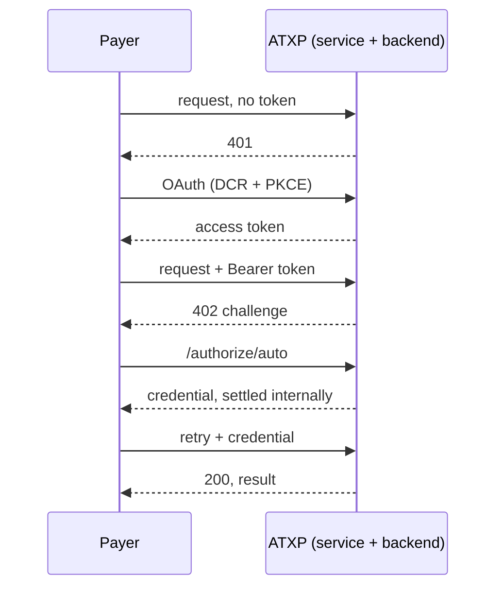
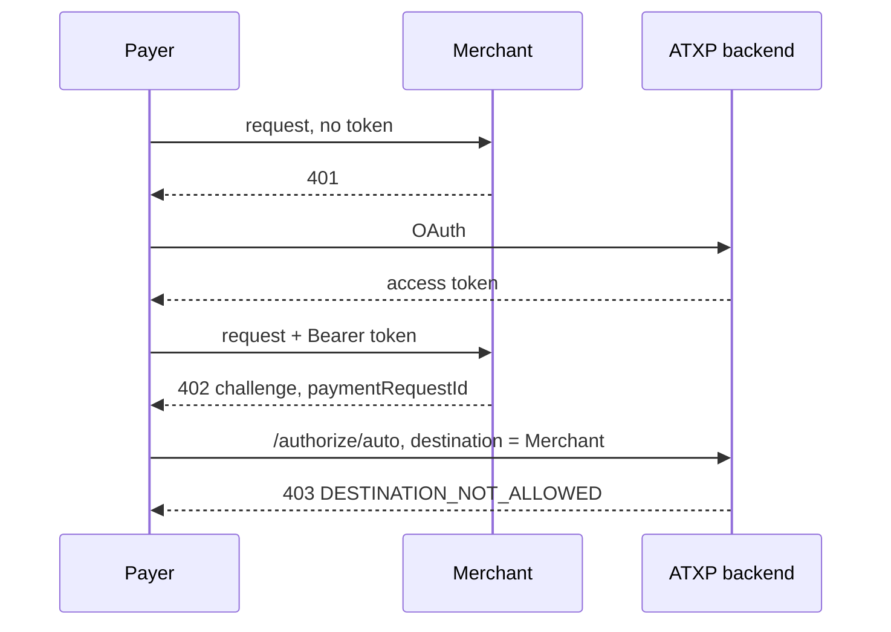
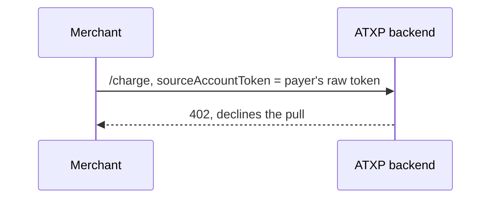
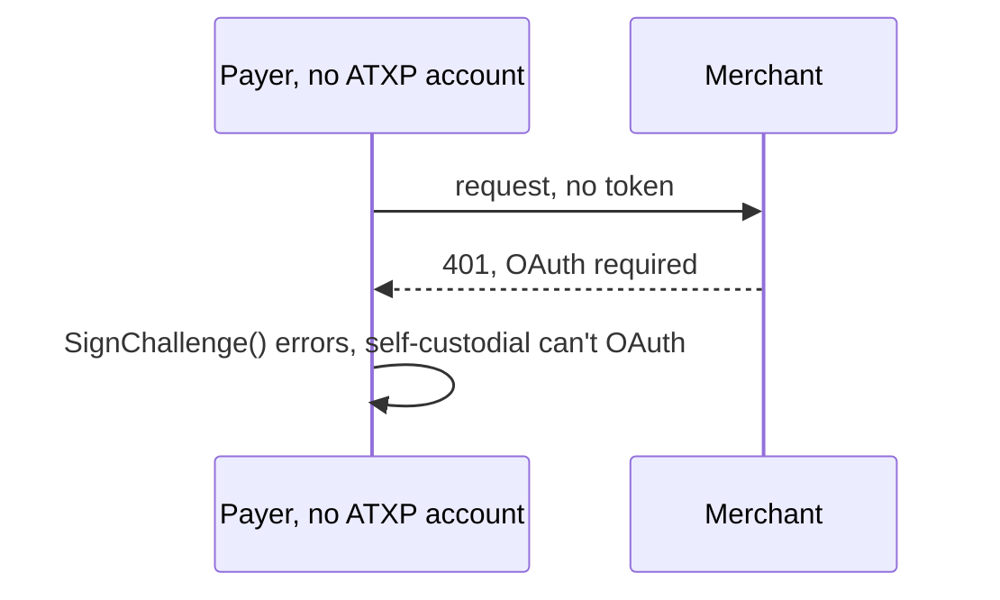
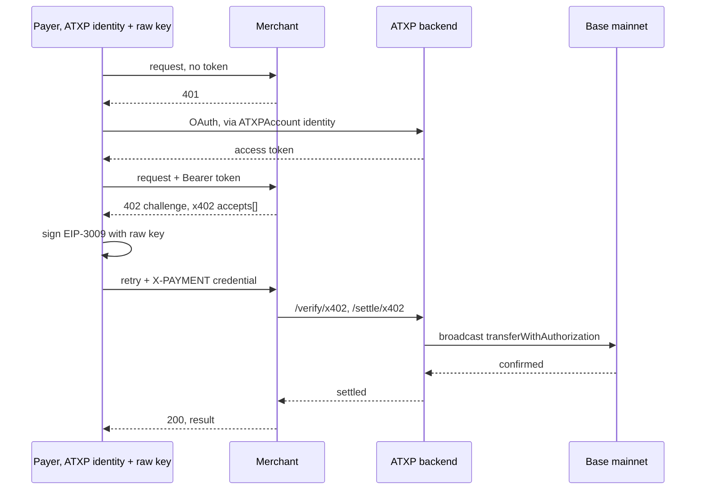
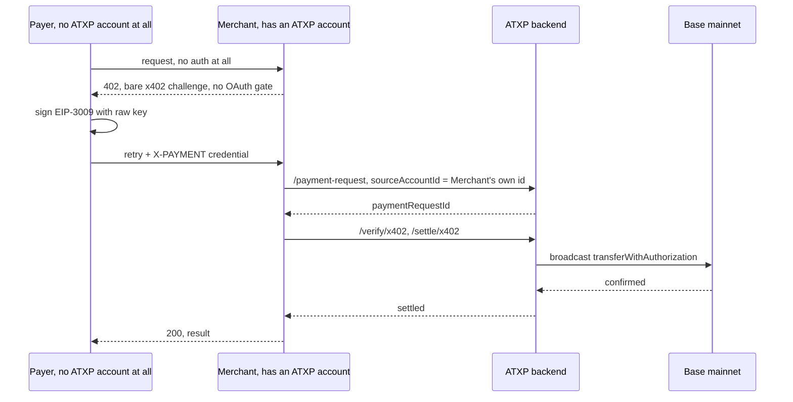
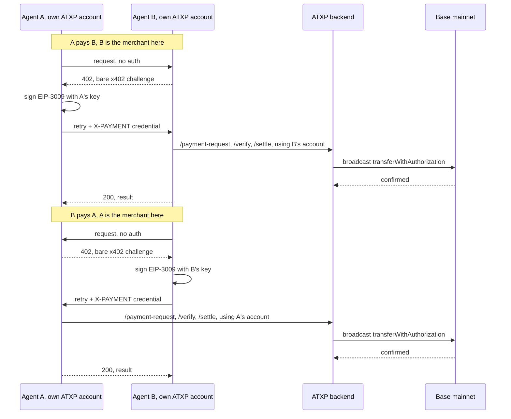

# ATXP protocol reference

Goal: let a Go program call paid ATXP MCP tools (web search, image/video/music
gen, X search, SMS, voice, code exec, …) using a **hosted ATXP account**
(connection string). ATXP is used only as a paid-tool rail; what the caller
does with the results is up to the caller.

Source of truth: read the TypeScript SDK at `github.com/atxp-dev/sdk`
(packages `atxp-client`, `atxp-common`, `atxp-server`) directly. See
CLAUDE.md's "Keeping in sync with upstream" for how. All file:line references
below are into that tree.

## Account model

- `npx atxp agent register` creates an **orphan** agent (no human login, no
  owner). A fresh orphan is `fraud_blocked` and cannot `/sign` or pay until a
  payment method is added to that specific account.
- The web `/fund` page funds the account you're logged into by email (a
  separate `human`-type owner account), not the orphan agent. Funding the
  orphan goes through `npx atxp fund` (bills the token in `~/.atxp/config`).
- A `human`-type account funded via the web, using its connection string from
  the dashboard **Servers** page, works directly. The orphan `agent
  register` flow isn't required.
- The client surfaces a blocked account as a typed `RestrictionError`;
  `live_test.go` skips with that reason if the configured account is
  unfunded/blocked.

## Pull-mode `/charge` needs an established Connection, not just funds

- An account's displayed balance is real and spendable, but only through a
  full OAuth-authorized session with a specific resource.
- `server.RequirePayment`'s on-demand path (`SourceAccountToken` → `POST
  /charge`) only succeeds if the payer has already connected to *that
  specific resource*. See **Connections → Add MCP Server** on
  `accounts.atxp.ai`. Without a Connection, `/charge` returns 402 with
  `shortage: <amount>` for any amount, regardless of real balance; `GET
  /balance` on the same auth server independently confirms this by returning
  `0` for an unconnected caller.
- A Connection forms automatically and headlessly the first time a client
  pays a resource (no dashboard step needed). chit's client already does
  this. It requires the resource to be a real, reachable HTTPS server (PRM
  discovery + DCR + `/authorize` all hit it over the network); a
  placeholder/synthetic `Resource` string can never form one.

## IOU conversion

A funded account's balance is an internal ledger entry (an "IOU" ATXP owes
that account), not on-chain money sitting anywhere. "IOU conversion" is
turning that ledger entry into a real settled transfer. For ATXP's own
first-party services this happens transparently. For a third-party merchant
it doesn't: `/authorize/auto` rejects it with `403 DESTINATION_NOT_ALLOWED`
regardless of Connection state or chain addresses attached to the
destination (payment-modes table, case 2, below). This is why `x402signer/`
exists: x402/MPP are the rails that actually convert to real settled money
for a non-ATXP destination.

## Reference merchants

- `examples/paidmcp` is a real, runnable MCP server wrapping `server.Merchant`
  (a paid `ping` tool, `$0.01`); `examples/paidmcp/client` drives the payer
  side through chit's client package.
- `examples/x402stranger` is the equivalent for the bare-402, no-OAuth,
  self-custodial path (see the payment-modes table below).
- To expose a local merchant publicly for a real OAuth handshake: `tailscale
  funnel <port>` (needs Funnel enabled on the tailnet and `sudo tailscale set
  --operator=$USER` once, run interactively). Plain private Tailscale
  networking is not enough; ATXP's cloud backend needs a real public URL.
- `server.StaticDestination` needs real chain addresses in `Addresses` (from
  the merchant account's own `GET /me` → `sources[]`), not just the bare
  `ID`, otherwise x402/MPP options are silently empty (`no x402-compatible
  networks among N sources` in the log).

## Scope decision

ATXP has **two account types** (`atxpFetcher.ts:238`):

- **`ATXPAccount` (hosted, connection string)**: `usesAccountsAuthorize = true`. The
  client does **zero on-chain crypto**: every signing/settlement op is an HTTP call to
  the ATXP accounts server. Only `ATXPAccountHandler` is used; the x402/MPP local payment
  makers are never instantiated. **This is what chit's root package builds.**
- Self-custodial (Base/Solana wallet): uses `@x402/evm`, EIP-712 signing,
  `X402ProtocolHandler`/`MPPProtocolHandler`. **Built and live-verified
  (2026-08-06):** `x402signer/` implements EIP-3009 "exact"-scheme signing on
  EVM chains as an `atxp.Account`. See its package doc comment for the full
  scope. Still out of scope: the `upto`/Permit2 x402 scheme, Solana, and MPP
  entirely. Rationale for building this despite the "hosted account only"
  default: the hosted/ATXP-native rail is restricted to ATXP's own
  first-party services for real settlement (see the pull-mode/IOU-conversion
  notes above). x402 (and MPP) are the actual open, direct-settlement rails
  third-party payments go through. Real 0.01 USDC settlement on Base mainnet
  confirmed via the on-chain `Transfer` event log.

  The x402 v2 `PaymentPayload`'s `accepted` field must carry the **full**
  matching `PaymentRequirements` (`scheme`, `network`, `asset`, `amount`,
  `payTo`, `maxTimeoutSeconds`, `extra`), not just `{network, scheme}`. See
  `coinbase/x402`'s `go/types/v2.go` `PaymentPayload` struct. A trimmed
  `accepted` still satisfies chit's own server-side `selectX402Accept`
  (it only reads `.network`/`.scheme`), so this only surfaces as a generic
  `500` from ATXP's real `/verify/x402` and `/settle/x402`.

### Payment modes: what actually works (live-tested 2026-08-06)

| Payer identity | Destination | Resource gate | Rail | Result |
|---|---|---|---|---|
| `ATXPAccount` (OAuth) | ATXP's own first-party service | OAuth 401 | ATXP-native | **Works** (pre-existing, validated in production) |
| `ATXPAccount` (OAuth) | Third-party merchant (not ATXP) | OAuth 401 | ATXP-native (`/authorize/auto`) | **Fails**: `403 DESTINATION_NOT_ALLOWED` |
| `ATXPAccount`, raw `SourceAccountToken` (no OAuth Connection) | Third-party merchant | bare 402 (on-demand pull) | ATXP-native (`/charge`) | **Fails**: declines the pull, issues a 402 challenge instead |
| `X402SignerAccount` alone (no ATXP account) | Third-party merchant | OAuth 401 | x402 | **Fails**: `SignChallenge` errors immediately, by design, no ATXP identity to OAuth with |
| Hybrid: `ATXPAccount` (identity) + `X402SignerAccount` (`Authorize`) | Third-party merchant | OAuth 401 | x402 "exact" | **Works**, live-verified, real 0.01 USDC on Base mainnet, confirmed on-chain |
| `X402SignerAccount` alone (no ATXP account) | Third-party merchant | bare 402, no OAuth gate at all | x402 "exact" | **Works**, live-verified, real 0.01 USDC on Base mainnet, confirmed on-chain three times. This is the actual stranger-to-stranger case from the original deferred plan. The merchant must still supply an existing, resolvable ATXP account id as the nominal `sourceAccountId` on `/payment-request` (a made-up placeholder like `"anonymous-x402-payer"` gets a `500`), but the merchant's own account id works fine, so this imposes no real dependency on the payer at all. |

**Fraud-block bypass, confirmed live:** a fresh `agent register`-ed orphan account (unfunded, `fraud_blocked`, can't `/sign` or pay natively) still worked fine as the nominal `sourceAccountId` on this path, real settlement, real money, no rejection anywhere. Whatever gates that account from `/sign`/native pay is not checked on `/payment-request` → `/verify/x402` → `/settle/x402` at all. Since this field never has to correspond to the actual signer anyway (see above), this isn't a merchant "tricking" a specific blocked payer, it's that this rail doesn't enforce account standing on `sourceAccountId` for anyone.

In every row below, "Merchant" is the third-party resource (`examples/paidmcp`/`bareserver`, our own account), never ATXP itself, except row 1, where ATXP's own service *is* the merchant.

**1. `ATXPAccount` to ATXP's own first-party service. Works.**



**2. `ATXPAccount` to a third-party merchant, native rail. Fails.**



**3. Raw `SourceAccountToken` pull, no OAuth Connection. Fails.**



**4. `X402SignerAccount` alone against an OAuth-gated merchant. Fails.**



**5. Hybrid account (`ATXPAccount` identity + `X402SignerAccount` signing) against an OAuth-gated merchant. Works, on-chain verified.**



**6. `X402SignerAccount` alone against a bare-402 merchant, true stranger to stranger. Works, on-chain verified twice.**



**7. Two agents swapping money both ways. Each direction repeats case 6 independently, so each agent needs its own ATXP account for the direction where it's receiving.**



Confirmed: **no Go (or Python-native) ATXP SDK exists.** `atxp-dev` is ~17 repos, all
TS/JS. The only native SDK is `@atxp/client` (npm). Python/other support is framework
adapters + raw HTTP.

## Connection string

A URL: `https://accounts.atxp.ai/?connection_token=<TOKEN>&account_id=<ID>`
(`account_id` optional; fetched from `/me` if absent). Parse → `origin`, `token`,
`accountId?` (`atxpAccount.ts:12`). Qualified account id is `atxp:<accountId>`.

## ATXP accounts-server endpoints (the hosted backend)

All on `origin`. Auth header differs per endpoint: match exactly:

| Endpoint | Method | Auth header | Body | Returns |
|---|---|---|---|---|
| `/me` | GET | `Bearer <token>` | none | `{accountId, …}` |
| `/sign` | POST | `Basic base64(token+":")` | `{paymentRequestId, codeChallenge, accountId?}` | `{jwt}` |
| `/authorize/auto` | POST | `Basic base64(token+":")` | see below | `{protocol, credential, context?}` |
| `/spend-permission` | POST | `Bearer <token>` | `{resourceUrl}` | `{spendPermissionToken}` |
| `/pay` | POST | `Basic base64(token+":")` | `{destinations[], memo, paymentRequestId?}` | `{transactionId, chain, currency, …}` |
| `/address_for_payment` | POST | `Basic base64(token+":")` | `{amount, currency, receiver, memo}` | `{sourceAddress, sourceNetwork?}` |
| `/account/{id}/sources` | GET | none (Accept only) | none | `Source[]` |

`Basic` = `"Basic " + base64(token + ":")` (blank password, `atxpAccount.ts:6`).

For the hosted MCP-tool path you only need **`/me`, `/sign`, `/authorize/auto`**
(and optionally `/spend-permission`). `/pay` and `/address_for_payment` are the
self-custodial push-mode path, not needed.

## Flow: calling an MCP tool (hosted account)

The whole client is a **fetch wrapper** around MCP's Streamable HTTP transport
(`atxpClient.ts:83`, `atxpFetcher.ts:845`). In Go, implement it as a custom
`http.RoundTripper` (or `*http.Client`) handed to the go-sdk Streamable HTTP transport.

### Leg 1: OAuth handshake (first call to an MCP server → 401)

`oAuth.ts` + `oAuthResource.ts`.

1. MCP request → server returns **401** with `WWW-Authenticate: Bearer
   resource_metadata="<PRM URL>"` (also accept a bare-URL form) (`oAuth.ts:88`).
2. Discover the authorization server (`oAuthResource.ts:150`):
   - GET `<resourceUrl>/.well-known/oauth-protected-resource` (RFC 9728) →
     `authorization_servers[0]`.
   - Fallback if 404 (non-strict): GET
     `<resourceUrl-origin>/.well-known/oauth-authorization-server` → `issuer`.
   - Discovery request on the AS URL → AS metadata
     (`authorization_endpoint`, `token_endpoint`, `registration_endpoint`).
3. Client credentials for the AS issuer (`oAuthResource.ts:registerClient`): from DB,
   else **Dynamic Client Registration** (RFC 7591) POST to `registration_endpoint`
   with headers `X-ATXP-Registration-Type: client` (+ `X-ATXP-TOKEN: <token>` if set).
   Cache by issuer. (Concurrent-registration lock exists in TS; single-flight in Go.)
4. (Optional) POST `/spend-permission` (Bearer) → `spendPermissionToken`.
5. Build authorization URL (`oAuth.ts:makeAuthorizationUrl`): params `client_id`,
   `redirect_uri`, `response_type=code`, `code_challenge` (**S256**),
   `code_challenge_method=S256`, `state`, `resource=<resourceUrl>`,
   `spend_permission_token?`.
6. **ATXP twist** (`atxpFetcher.ts:527`, the `makeAuthRequestWithPaymentMaker`): instead
   of a browser redirect, GET `authorizationUrl + "&redirect=false"` with header
   `Authorization: Bearer <JWT>`, where the JWT comes from POST `/sign`
   `{paymentRequestId:"", codeChallenge:<the challenge>}`. Server replies either:
   - 3xx with `Location: <callback?code=…&state=…>`, or
   - 200 with body `{redirect: "<callback?code=…&state=…>"}` (the `redirect=false` hack).
7. Handle callback (`oAuth.ts:handleCallback`): parse `state` → look up saved PKCE →
   validate → **exchange code** at `token_endpoint` (auth-code grant + `code_verifier`)
   → `{access_token, refresh_token, expires_in}`. Save keyed by (userId=accountId, url).
8. Retry the MCP request with `Authorization: Bearer <access_token>`.

Token refresh (`oAuth.ts:fetch`): on 401 carrying `error="invalid_grant"`, refresh via
`refresh_token` grant, retry once.

### Leg 2: payment challenge (tool call → payment required)

Trigger: HTTP **402**, or an MCP JSON-RPC **error code `-30402` or `-32042`** whose
`data` carries `chargeAmount`, `x402`, `mpp`, `paymentRequestUrl`, `paymentRequestId`
(`atxpFetcher.ts:471`, `:896`). For MCP the challenge arrives inside a 200 JSON-RPC body;
TS synthesizes a fake 402 Response to feed the handler (`atxpFetcher.ts:764`); in Go just
branch on the parsed error directly.

Hosted path = `ATXPAccountHandler` only (`atxpAccountHandler.ts`):

1. Build authorize params from challenge data (`buildAuthorizeParams`): `amount`
   (`chargeAmount`), `destination`/`receiver`, `paymentRequirements` (from `x402.accepts`,
   non-`atxp` networks), `challenges` (from `mpp`). If destination still unknown, GET
   `paymentRequestUrl` and read `options[0]`.
2. POST `/authorize/auto` (Basic). Body:
   ```json
   {"protocols":["atxp"],            // +"x402" if paymentRequirements present, +"mpp" if challenges
    "amount":"<str>","receiver":"<dest>","memo":"<iss/payee>","currency":"USDC",
    "paymentRequirements":{...},     // optional
    "challenges":[...]}              // optional
   ```
   60s timeout. Response `{protocol, credential, context?}`. If `protocol==="atxp"`,
   parse the credential JSON and inject `sourceAccountToken = <token>` before re-stringify
   (`atxpAccount.ts:authorize`).
3. Map credential → header (`paymentHeaders.ts`):
   - `x402` → `X-PAYMENT: <credential>` (+ `Access-Control-Expose-Headers: X-PAYMENT-RESPONSE`)
   - `mpp`  → `Authorization: Payment <credential>` (do **not** also set Bearer)
   - `atxp` → `X-ATXP-PAYMENT: <credential>`
   - plus `X-ATXP-Payment-Request-Id: <id>` if present.
4. Retry the request **through the OAuth fetch** so the Bearer token is also attached
   (server wants both the payment header AND OAuth identity, `atxpFetcher.ts:737`).

## Go component map

| Concern | Go |
|---|---|
| MCP Streamable HTTP client | `github.com/modelcontextprotocol/go-sdk`; inject custom `*http.Client`/RoundTripper |
| OAuth token grants + PKCE | `golang.org/x/oauth2` (S256 PKCE); auth-code only, no refresh-token grant wired (any expired/401 token triggers a full re-handshake instead) |
| PRM/AS discovery (RFC 9728/8414) + DCR (RFC 7591) | plain `net/http`, ~150 lines, no single lib |
| PKCE values | `crypto/rand`, `crypto/sha256`, `encoding/base64` RawURLEncoding |
| JWT for code_challenge | **none**: `/sign` returns it; just forward the string |
| On-chain signing | **none** for hosted path |
| Token/PKCE/cred store | small interface; in-memory map is fine (mirror `OAuthDb`) |

`OAuthDb` surface mirrored: `save/getPKCEValues(userId, state)`,
`save/getClientCredentials(issuer)`, `save/getAccessToken(userId, url)`. Note token
lookup walks parent paths (`oAuthResource.ts:getAccessToken`).
